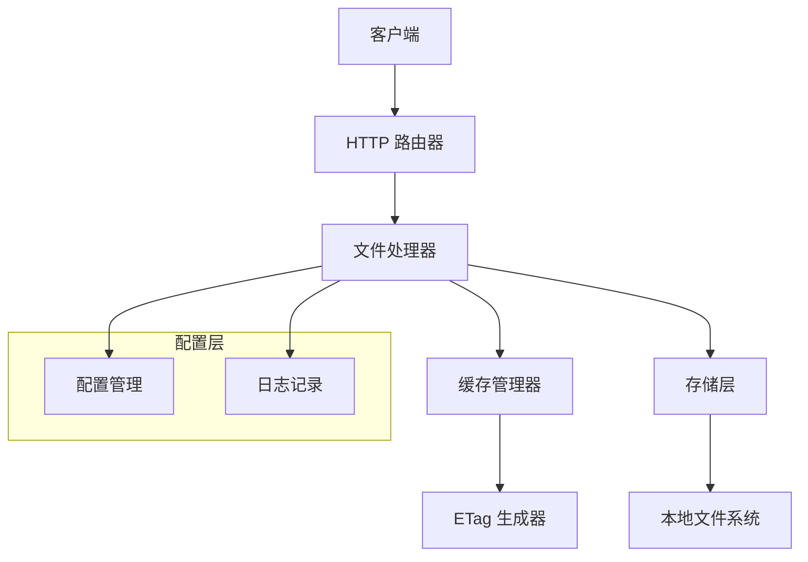
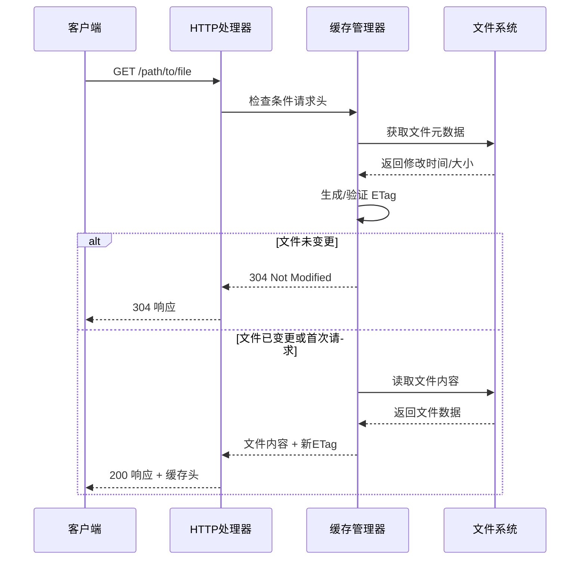

# 设计文档

## 概述

本设计文档描述了一个使用 Go 语言实现的简化 S3 兼容静态文件服务。该服务专注于单个 bucket 的静态文件访问，具备智能缓存管理、内容变更检测和高效的网络请求优化功能。

核心设计原则：
- 简单性：支持单个 bucket，避免复杂的多租户逻辑
- 高效性：通过 ETag 和条件请求最小化网络传输
- 兼容性：提供基本的 S3 API 兼容性
- 可测试性：通过 testcontainers 支持集成测试

## 架构

### 整体架构



### 请求处理流程



## 组件和接口

### 1. HTTP 服务器组件

**职责：** 处理 HTTP 请求和响应，路由管理

```go
type Server struct {
    config *Config
    logger *Logger
    handler *FileHandler
}

type FileHandler struct {
    cacheManager *CacheManager
    storage      *Storage
    config       *Config
}
```

**接口：**
- `ServeHTTP(w http.ResponseWriter, r *http.Request)`
- `handleGetObject(w http.ResponseWriter, r *http.Request)`
- `handleHealthCheck(w http.ResponseWriter, r *http.Request)`

### 2. 缓存管理组件

**职责：** ETag 生成、条件请求处理、缓存头设置

```go
type CacheManager struct {
    defaultCacheDuration time.Duration
}

type ETagGenerator interface {
    Generate(filePath string, modTime time.Time, size int64) string
    Validate(etag string, filePath string, modTime time.Time, size int64) bool
}
```

**接口：**
- `GenerateETag(filePath string, fileInfo os.FileInfo) string`
- `CheckConditionalRequest(r *http.Request, etag string, modTime time.Time) bool`
- `SetCacheHeaders(w http.ResponseWriter, etag string, modTime time.Time)`

### 3. 存储层组件

**职责：** 文件系统访问、文件元数据获取

```go
type Storage struct {
    basePath string
}

type FileInfo struct {
    Path     string
    Size     int64
    ModTime  time.Time
    IsDir    bool
}
```

**接口：**
- `GetFileInfo(path string) (*FileInfo, error)`
- `ReadFile(path string) ([]byte, error)`
- `FileExists(path string) bool`

### 4. 配置管理组件

**职责：** 配置加载、环境变量处理

```go
type Config struct {
    Port                string
    BasePath           string
    DefaultCacheDuration time.Duration
    BucketName         string
    LogLevel           string
}
```

## 数据模型

### 配置模型

```go
type ServerConfig struct {
    // 服务器配置
    Port     string `env:"PORT" default:"8080"`
    Host     string `env:"HOST" default:"0.0.0.0"`
    
    // 存储配置
    BasePath   string `env:"BASE_PATH" default:"./data"`
    BucketName string `env:"BUCKET_NAME" default:"default"`
    
    // 缓存配置
    DefaultCacheDuration time.Duration `env:"CACHE_DURATION" default:"1h"`
    
    // 日志配置
    LogLevel string `env:"LOG_LEVEL" default:"info"`
}
```

### 响应模型

```go
type ErrorResponse struct {
    Code    string `json:"Code"`
    Message string `json:"Message"`
    Key     string `json:"Key,omitempty"`
}

type ObjectResponse struct {
    ContentType   string
    ContentLength int64
    ETag          string
    LastModified  time.Time
    CacheControl  string
    Body          []byte
}
```

## 错误处理

### 错误类型定义

```go
type ErrorType int

const (
    ErrorNotFound ErrorType = iota
    ErrorForbidden
    ErrorInternalServer
    ErrorBadRequest
)

type ServiceError struct {
    Type    ErrorType
    Message string
    Path    string
}
```

### 错误处理策略

1. **文件不存在 (404)**
   - 返回标准的 S3 NoSuchKey 错误响应
   - 记录访问日志但不记录错误日志

2. **权限错误 (403)**
   - 返回 AccessDenied 错误响应
   - 记录安全相关的错误日志

3. **服务器内部错误 (500)**
   - 返回 InternalError 响应
   - 记录详细的错误堆栈信息

4. **请求格式错误 (400)**
   - 返回 InvalidRequest 响应
   - 记录请求参数信息

## 测试策略

### 单元测试

1. **缓存管理器测试**
   - ETag 生成算法验证
   - 条件请求处理逻辑
   - 缓存头设置正确性

2. **存储层测试**
   - 文件读取功能
   - 文件信息获取
   - 错误场景处理

3. **HTTP 处理器测试**
   - 路由处理正确性
   - 响应格式验证
   - 错误响应测试

### 集成测试

1. **Testcontainers 集成测试**
   - 使用 MinIO 容器验证 S3 兼容性
   - 端到端的文件访问测试
   - 缓存行为验证

2. **性能测试**
   - 并发请求处理能力
   - 大文件传输性能
   - 缓存命中率测试

### 测试工具和框架

```go
// 使用 testcontainers 进行集成测试
type TestSuite struct {
    minioContainer testcontainers.Container
    serverURL      string
    client         *http.Client
}
```

## 性能考虑

### ETag 生成策略

1. **基于文件元数据的 ETag**
   - 使用文件修改时间 + 文件大小生成
   - 避免读取完整文件内容
   - 适用于大文件场景

2. **基于内容哈希的 ETag**
   - 使用文件内容的 MD5 或 SHA256 哈希
   - 提供更强的一致性保证
   - 适用于小文件场景

### 缓存优化

1. **HTTP 缓存头设置**
   - Cache-Control: max-age 设置
   - ETag 强验证器
   - Last-Modified 弱验证器

2. **条件请求优化**
   - If-None-Match 头处理
   - If-Modified-Since 头处理
   - 304 Not Modified 响应优化

### 并发处理

1. **文件系统访问优化**
   - 使用 Go 的并发安全文件操作
   - 避免文件锁竞争
   - 合理的 goroutine 池管理

2. **内存使用优化**
   - 大文件流式传输
   - 避免将整个文件加载到内存
   - 合理的缓冲区大小设置